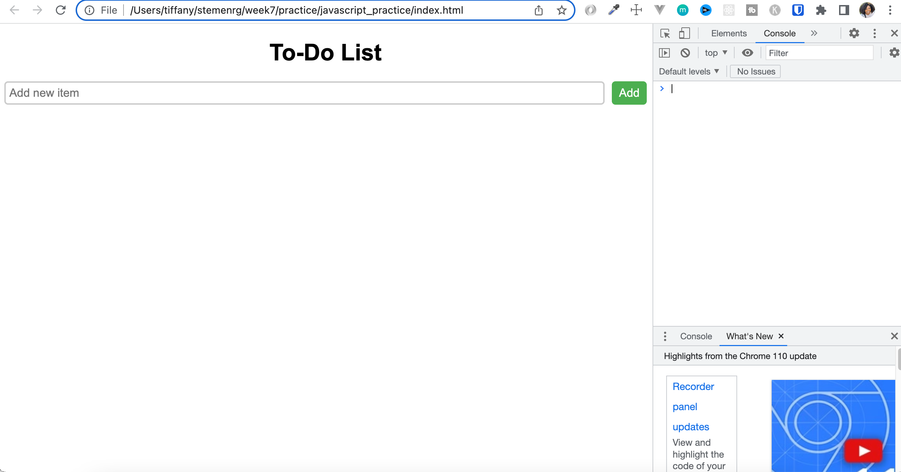

# Javascript Practice with ToDo App
We are creating a ToDo App that allows a user to add a new item to a list, mark an item on the list as completed and delete an item.

# How to start
You can either unzip the files or clone the repository on github

## Unzip files
Navigate to where you want to add these files on your computer. Then click on the files to unzip them.

## Clone the Repository
Open VSCode, Then go to Terminal --> New Terminal 
Once the terminal is open, use the link below to clone the repository

`git clone https://github.com/STEM-ENRG/javascript_practice.git`

> Note: If you set up SSH, then use the ssh link: git@github.com:STEM-ENRG/javascript_practice.git

# Open the files in VSCode
If you've unzipped the files, then follow the instructions from unzip. If you cloned then follow the clone instructions

## Unzip
Open VSCode and Click Open and choose the folder where you placed the unzipped files in

## Clone
@todo:
I think you may have to open again in VSCode? Test this out

Change to the directory where the files are: `cd javascript_practice`

Make sure you have 7 files in your directory: `ls`
There should be 7 files listed after running this command

# Start

Open the index.html file in the browser: In the terminal, type this command: 

Mac: `open index.html` 

Windows: `start index.html`

> **Note** You only have to do this once to launch in the browser. Afterwards, you only need to refresh the page in order to see the new changes.

In VSCode: Click on the `script.js` file. You can also open the other files but the javascript file contains the instructions you need to complete this. 

You will notice there are Step by Step comments in the `script.js` file that will help you complete the application. If you get stuck, I've included a Javascript_Cheatsheet.md file and Javascript_Cheatsheet.pdf file to help you with the definitions of the things used in the script.js code

If you have further questions, let me know.

---
After opening the page in the browser, you should also open the console in the browser. 

In the browser: right click --> Select Inspect --> Select Console from the panel

This is what you should see:

# Checkpoints
There are a few checkpoints included while you complete the steps so that you can confirm that you are on the right track. Those checkpoint images are included in this section. 

## After Step 4 Checkpoint Image

## Step 7 Checkpoint Image

## Step 10 Checkpoint Image

## Step 13 Checkpoint Image
