# Javascript Practice with ToDo App
We are creating a ToDo App that allows a user to add a new item to a list, mark an item on the list as completed and delete an item.

# How to start
You can either unzip the files or clone the repository on github

## Unzip files
Navigate to where you want to add these files on your computer. Drag and drop the unzipped file. Then double click on the zipped file to unzip.

## Clone the Repository
Open VSCode, Then go to Terminal --> New Terminal 
Once the terminal is open, use the link below to clone the repository

`git clone https://github.com/STEM-ENRG/javascript_practice.git`

> Note: If you set up SSH, then use the ssh link: `git@github.com:STEM-ENRG/javascript_practice.git`

# Open the files in VSCode
If you've unzipped the files, then follow the instructions from the Unzip section. If you cloned then follow the clone instructions.

## Unzip
Open VSCode and Click Open and choose the folder where you placed the unzipped files.

## Clone
@todo:
I think you may have to open again in VSCode? Test this out

Change to the directory where the files are: `cd javascript_practice`

Make sure you have 7 files in your directory: `ls`
There should be 7 files listed after running this command

# Start

Open the index.html file in the browser.

In the terminal, type this command: 

Mac: `open index.html` 

Windows: `start index.html`

> **Note** You only have to do this once to launch in the browser. Afterwards, you only need to refresh the page in order to see the new changes. If close the browser, then you can reopen by using either of the above commands

In VSCode: Click on the `script.js` file. You can also open the other files but the javascript file contains the instructions you need to complete this. 

You will notice there are Step by Step comments in the `script.js` file that will help you complete the application. If you get stuck, I've included a Javascript_Cheatsheet.md file, Javascript_Cheatsheet.pdf and Javascript_Cheatsheet.html file to help you with the definitions of the things used in the script.js code. NOTE: Each Javscript_Cheatsheet file is the same, I've provided different file types.

If you have further questions, let me know.

---
# After Start Instructions
After opening the page in the browser, you should also open the console in the browser. 

In the browser: right click --> Select Inspect --> Select Console from the panel

Video to open console in browser:
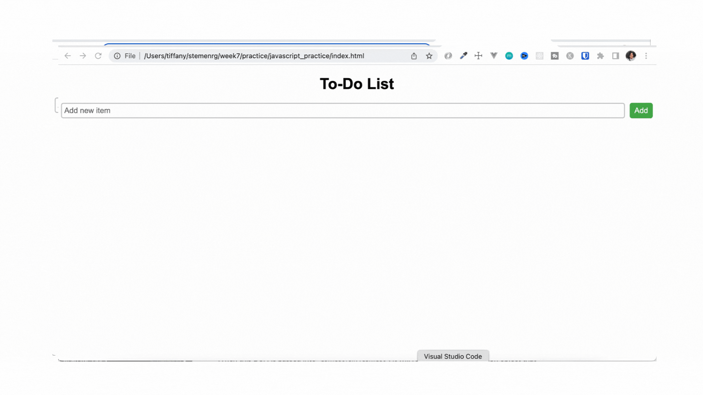

# Checkpoints
There are a some checkpoints included while you complete the steps so that you can confirm that you are on the right track. Those checkpoint images are included in this section. 

## After Step 4 Checkpoint Image
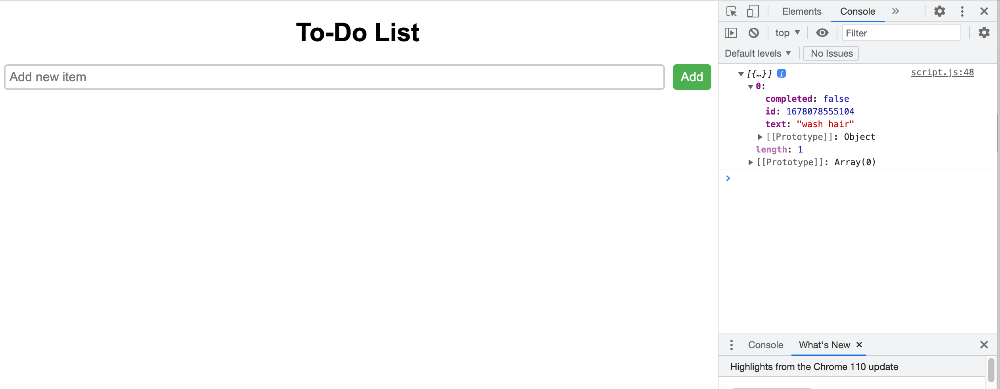

### After Step 4 Checkpoint Video
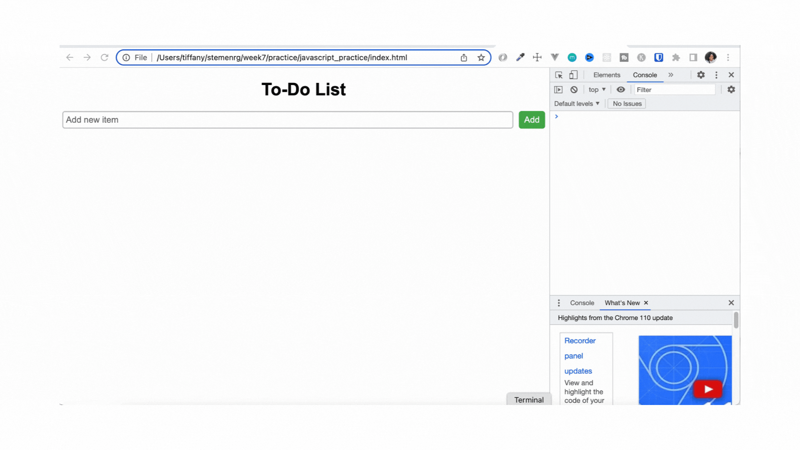

## After Step 7 Checkpoint Image
Make sure you console is still open - Refer back to the Start section above if it's not.Refresh the page. Type in some text in the input and click Add. 

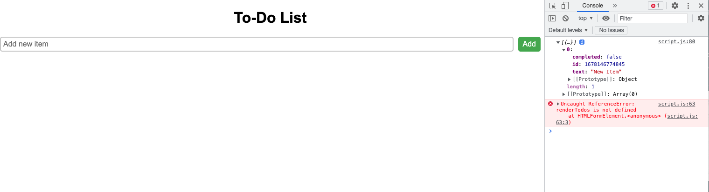

### After Step 7 Checkpoint Video
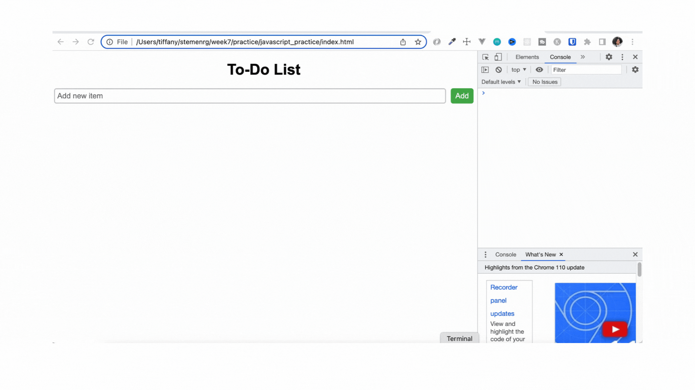

## After Step 10 Checkpoint Image
Open the console (right click --> select Inspect), Refresh the browser, Add a new item on to form and click Add. 
You should see output display to the console:

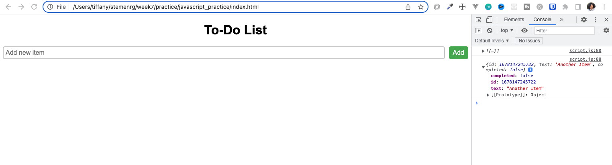

### After Step 10 Checkpoint Video
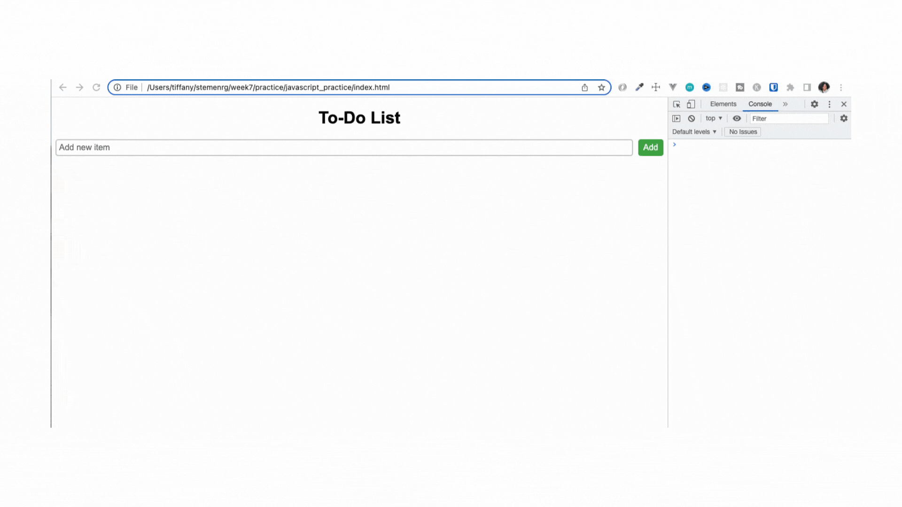

## After Step 13 Checkpoint Image
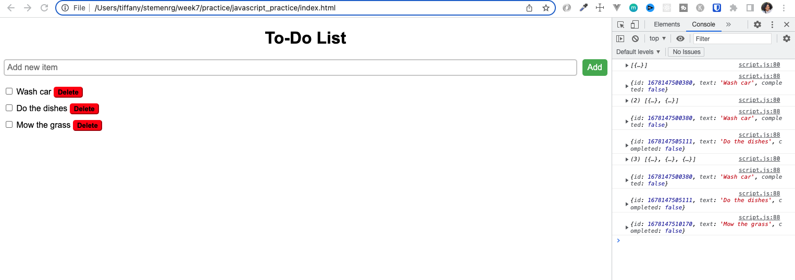

### After Step 13 Checkpoint Video

## After Step 17 Checkpoint Image
Add three todos, check the box beside the second one. In the console: you should see the object of information for the item you checked. The information in the object will have completed: false, the id will be an integer and the title will have the title of the todo.

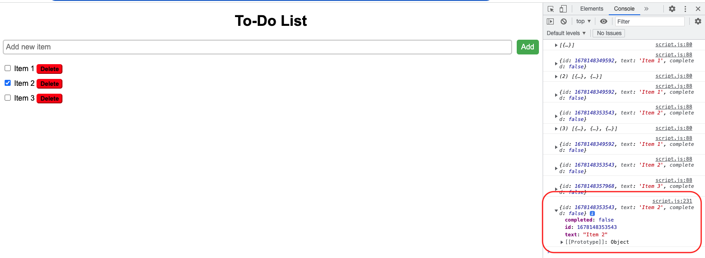

### After Step 17 Checkpoint Video

## After Step 19 Checkpoint Image
Refresh the browser, add a couple todos, check the box beside at least one, the todo should be crossed out
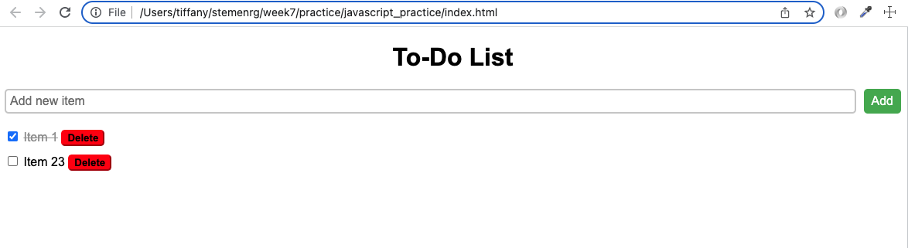

### After Step 19 Checkpoint Video
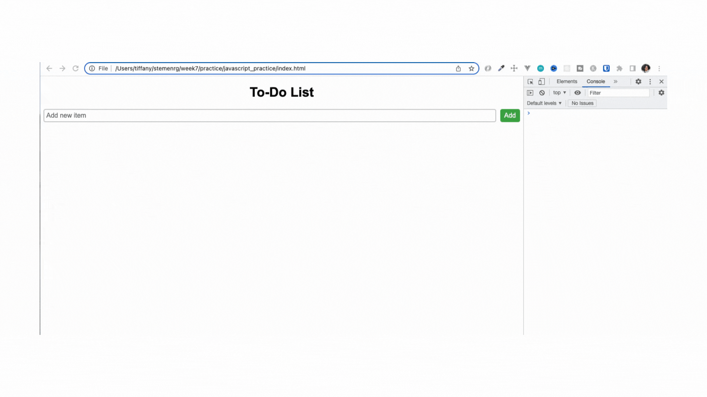

## After Step 24 Checkpoint
Everything should be working now :)
Create some todos, mark them completed and delete a couple

### After Step 24 Checkpoint Video
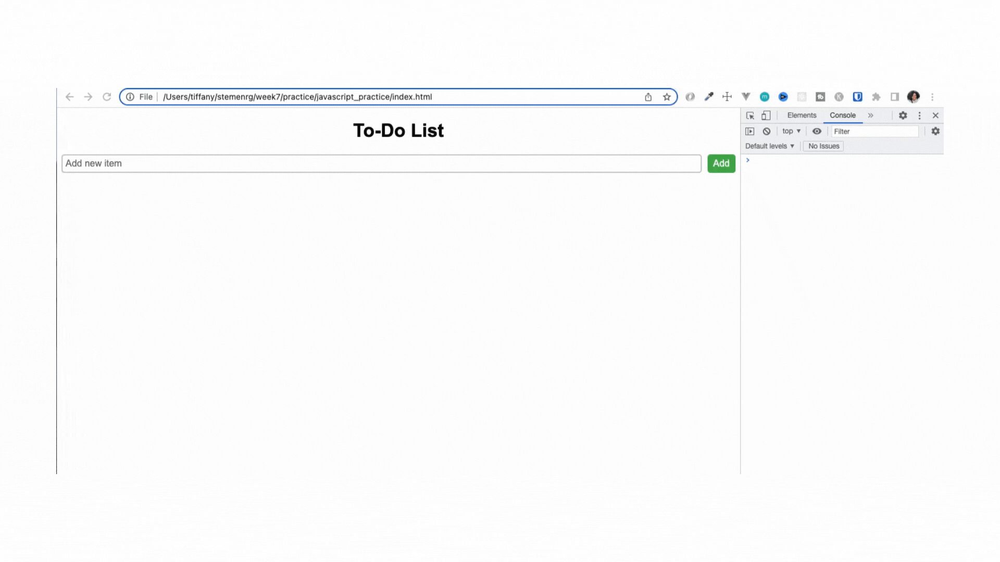

### After Step 25 Checkpoint Video
Refresh the page. Notice how the todos are still there on the page.

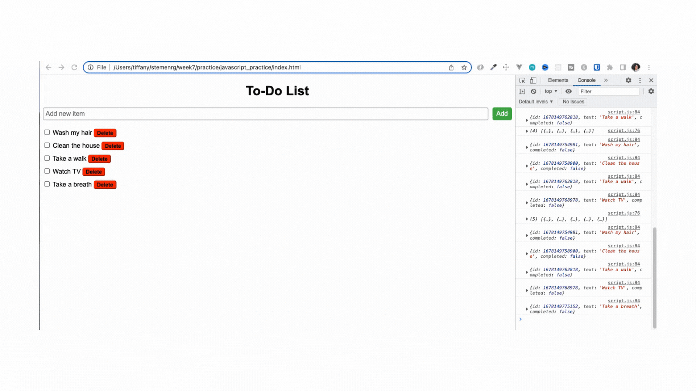
